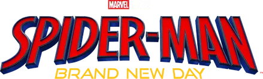

# 🕷️ Spider-Man: Brand New Day



## 📌 Sobre o Projeto

Landing Page inspirada no filme **Spider-Man: Brand New Day**, desenvolvida com foco em uma experiência visual cinematográfica.

O projeto apresenta uma nova fase do Homem-Aranha, explorando a jornada de Peter Parker após os acontecimentos de **Spider-Man: No Way Home**, utilizando uma identidade visual baseada no universo do personagem.

A página foi criada com uma combinação de cores marcantes, imagens em destaque, efeito parallax e cards de personagens para criar uma experiência imersiva.

---

# 🌐 Link da Landing Page

🔗 Acesse:

```
COLOQUE AQUI O LINK DA SUA LANDING
```

Exemplo:

```
https://seuusuario.github.io/Spider-Man-Brand-New-Day/
```

---

# 🎬 Sobre a Landing Page

A página é dividida em diferentes seções:

## 🕷️ Home

A primeira seção apresenta o logo do filme e o Homem-Aranha como destaque principal.

Objetivo:
- Criar impacto visual inicial.
- Apresentar a identidade do projeto.
- Destacar o novo capítulo do herói.

---

## 🎞️ Trailer

Seção dedicada ao trailer do filme, utilizando um vídeo incorporado do YouTube.

Características:

- Fundo preto inspirado no clima dos filmes da Marvel.
- Destaque para o título em dourado.
- Área de vídeo com bordas arredondadas e sombra.

---

## 👁️ Transições Visuais

Foram utilizadas duas imagens de transição:

- Olhos do Homem-Aranha.
- Olhos de Peter Parker.

A ideia representa a relação entre:

```
O herói mascarado
        ↓
A pessoa por trás da máscara
```

O efeito foi criado utilizando:

- Background image.
- Background size.
- Background attachment fixed.

---

## 📖 Sinopse

A seção apresenta o novo momento da vida de Peter Parker.

Após todos esquecerem sua identidade, Peter precisa encontrar seu lugar no mundo enquanto continua protegendo Nova York como Homem-Aranha.

Elementos utilizados:

- Texto descritivo.
- Imagem do Peter Parker.
- Fundo vermelho inspirado no uniforme do herói.

---

# 🦸 Personagens

A seção apresenta cards dos principais personagens:

### 🕷️ Peter Parker / Homem-Aranha

O herói inicia uma nova fase de sua vida após perder sua identidade. Agora precisa descobrir quem é sem as pessoas lembrarem de seu passado.

---

### ❤️ Michelle "MJ" Jones-Watson

Uma das pessoas mais importantes da vida de Peter, representando sua ligação com o passado.

---

### 🧠 Ned Leeds

Melhor amigo de Peter Parker e uma figura importante na jornada do herói.

---

### 🔫 Frank Castle / Justiceiro

Um vigilante das ruas de Nova York que apresenta uma visão mais sombria do combate ao crime.

---

### 💚 Bruce Banner / Hulk

O cientista e herói conhecido como Hulk, conectando Peter ao universo maior da Marvel.

---

### 🦂 Mac Gargan / Escorpião

Um criminoso que se torna uma ameaça para o Homem-Aranha.

---

# 🎨 Identidade Visual

A paleta de cores foi baseada no universo do Homem-Aranha:

| Cor | Uso |
|---|---|
| 🔵 #0D2673 | Fundo principal e seções |
| 🔴 #D70000 | Navbar e destaques |
| 🔴 #AA1523 | Cards e sinopse |
| ⚫ #000000 | Trailer e transições |
| 🟡 #FBC513 | Títulos e detalhes |

---

# 🛠️ Tecnologias Utilizadas

## Front-end

- HTML5
- CSS3

## Recursos utilizados

- Flexbox
- CSS Background
- Efeito Parallax
- Hover Effects
- Layout responsivo
- Organização por seções
- Incorporação de vídeo

---

# 📂 Estrutura do Projeto

```
Spider-Man-Brand-New-Day
│
├── index.html
│
├── style.css
│
├── README.md
│
└── src
    │
    ├── logo.png
    ├── marvel.png
    ├── spider_poses.png
    ├── peter_parker.png
    ├── spider_eyes.png
    ├── peter_eyes.png
    │
    ├── spider.png
    ├── mj.png
    ├── ned.png
    ├── justiceiro.png
    ├── hulk.png
    └── scorpion.png
```

---

# ✨ Funcionalidades

✅ Navbar fixa com navegação entre seções  
✅ Rolagem suave  
✅ Trailer integrado  
✅ Efeito parallax nas imagens  
✅ Cards de personagens  
✅ Layout utilizando Flexbox  
✅ Identidade visual temática  
✅ Design adaptável para diferentes telas  

---

# 📚 Conceitos Aplicados

Durante o desenvolvimento foram utilizados conceitos como:

- Estruturação semântica em HTML.
- Organização de CSS por seções.
- Manipulação de imagens.
- Criação de layouts flexíveis.
- Uso de transições e efeitos visuais.
- Desenvolvimento de uma Landing Page completa.

---

# 👨‍💻 Desenvolvedor

Desenvolvido por:

**Lucca**

---

⭐ Projeto desenvolvido para prática de desenvolvimento Front-end.
